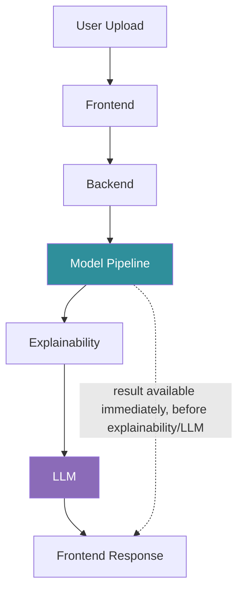
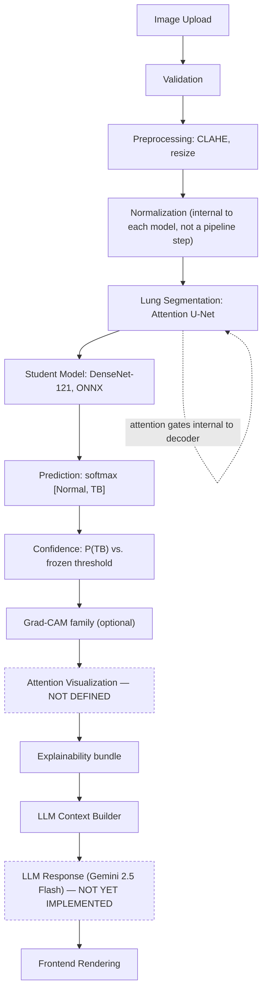
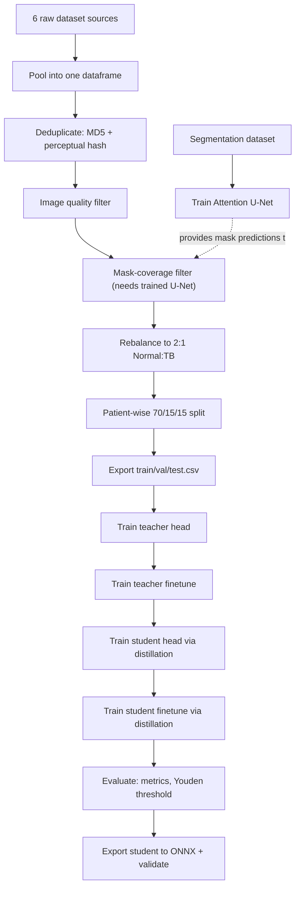
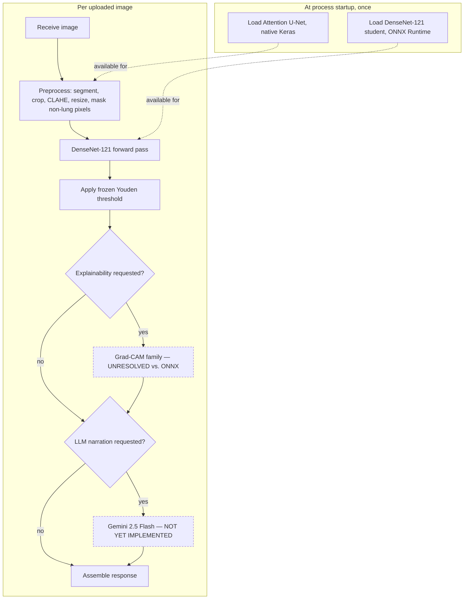
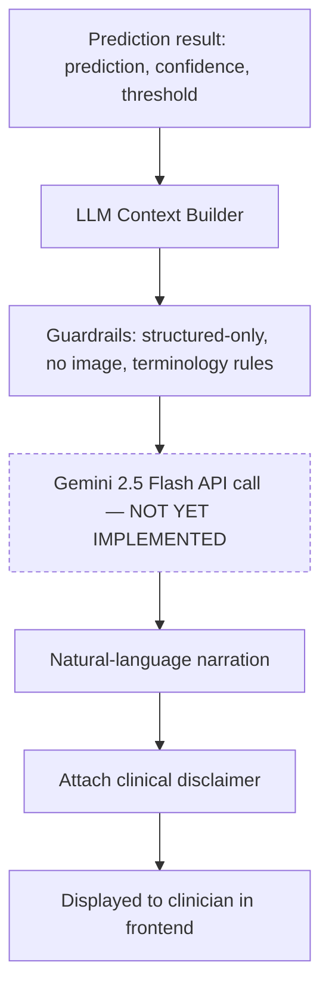
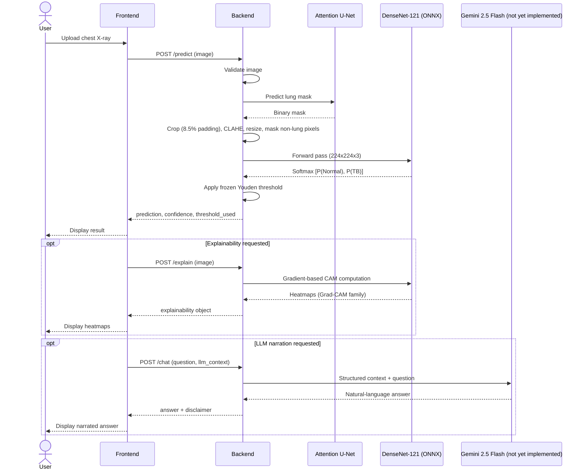

# AI Tuberculosis Detection System — Architecture

> **This document is the single source of truth for the project.** Every future backend, frontend, API, LLM, and deployment decision must follow it. Where it conflicts with existing code (`backend/`, `hf_space/`, or any documentation predating this session's DenseNet-121 decision), **this document wins** — that code is what needs to change, not this document.
>
> **Relationship to other docs in `docs/`:** [`API_SPEC.md`](API_SPEC.md) is the detailed endpoint-level contract derived from this architecture — read it when implementing the backend. [`PROJECT_HANDOFF.md`](PROJECT_HANDOFF.md) carries conversational history, bug history, and pending-task tracking that this document deliberately excludes to stay a clean reference. [`nirikshon_architecture_spec.html`](nirikshon_architecture_spec.html) is an earlier, differently-formatted pass over similar ground — this Markdown document is the newer, more complete one; treat it as authoritative where the two differ.
>
> Every fact below traces to `CNN Model Training/nirikNetMain.py`, this project's own documentation, or an explicit decision made during architecture discussions. Anything that cannot be traced this way is written as **"Not defined in the current architecture."** — not guessed.

---

## 1. Executive Summary

### Project objective

Screen chest X-rays for findings suspicious of pulmonary tuberculosis, as a clinical decision-support aid — not a diagnostic device. The clinician always makes the final call. The system's language reflects this throughout: "AI Screening Result," "Suspicious for Pulmonary Tuberculosis" — never "Confirmed" or "Diagnosed."

### System purpose

Reduce interpretation time and provide a second, explainable opinion for clinicians screening chest radiographs, particularly in settings (TB screening centres, rural clinics, high-volume government hospitals) where radiologist time is scarce.

### Overall workflow

```
User uploads X-ray → preprocessing (lung segmentation, crop, non-lung pixel masking, contrast enhancement)
  → DenseNet-121 classification → frozen decision threshold
  → optional explainability (Grad-CAM family) → optional LLM narration
  → result displayed to clinician
```

### Core technologies

| Layer | Technology |
|---|---|
| Model training | TensorFlow / Keras |
| Model serving (classifier) | ONNX Runtime |
| Teacher model | ResNet-50 (training-time only) |
| Student model (deployed) | DenseNet-121 |
| Segmentation model | Attention U-Net |
| Explainability | Grad-CAM, Grad-CAM++, LayerCAM, EigenCAM |
| LLM | Gemini 2.5 Flash (Google AI Studio API key) — **Decided, not yet implemented** |
| Backend + model hosting | Hugging Face Spaces (Docker SDK) — **Decided, not yet reconciled with this architecture** |
| Frontend hosting | Vercel — **Decided, not yet built** |

### Why this architecture was chosen

- **Teacher-student knowledge distillation** exists so a large, well-supervised network (ResNet-50) never has to be deployed — only a smaller network (DenseNet-121) that benefits from that supervision needs to run in production, on modest hardware.
- **ONNX export** exists because the training environment (Kaggle) and the intended serving environment cannot be guaranteed to run the same TensorFlow/Keras version — confirmed directly during this project's development (the project's canonical `tensorflow==2.15.1` pin is no longer an installable wheel on Kaggle's current Python). ONNX decouples the two.
- **Lung segmentation before classification** exists to stop the classifier from learning shortcuts — hospital markings, scanner artifacts, borders — instead of pulmonary pathology.
- **DenseNet-121 specifically** (not a from-scratch custom network) exists because it starts from ImageNet weights (lower overfitting risk on a modest training pool) and has direct precedent in chest-radiograph classification research (CheXNet).

---

## 2. High-Level System Architecture

| Component | Responsibility |
|---|---|
| **User** | Uploads a chest X-ray image. |
| **Frontend** | Collects the upload, displays the result. Never loads a model. Calls the backend as a remote API. |
| **Backend** | Orchestrates preprocessing, segmentation, classification, thresholding, optional explainability, optional LLM narration. The only component that loads models. |
| **Model Pipeline** | Attention U-Net (segmentation) → DenseNet-121 (classification, ONNX). |
| **Explainability** | Grad-CAM family, computed against the DenseNet-121 backbone. |
| **LLM** | Narrates an already-computed result in natural language. Never computes the result itself. |



*Note on the dotted line:* prediction and confidence do not have to wait for explainability or the LLM — both are optional, separately-requestable enhancements to an already-complete result (see Section 6 and `API_SPEC.md`).

---

## 3. End-to-End AI Pipeline

| Stage | Detail |
|---|---|
| **Image Upload** | User submits one chest X-ray via the frontend. Accepted formats match whatever the backend's image-reading function supports — standard raster formats, plus DICOM if `pydicom` is available. |
| **Validation** | An unreadable/corrupted file is rejected before any model runs. |
| **Preprocessing** | Grayscale read → (see Segmentation) → CLAHE contrast enhancement (`clipLimit=2.0`, `tileGridSize=8×8`) → resize to 224×224 → stacked to a canonical 0–255 RGB tensor. |
| **Normalization** | **Not a separate pipeline step.** Each model (teacher and student) owns its own internal normalization layer (`Lambda(preprocess_input)`), baked into the model graph itself — the shared pipeline only ever produces the canonical 0–255 tensor, never a pre-normalized one. |
| **Lung Segmentation** | Attention U-Net predicts a binary lung mask (256×256) → largest 2 connected components kept → morphological open+close cleanup → **enclosed holes filled via border-seeded flood fill** (any gap not touching the image border is treated as part of the lung — verified necessary on a real image, `tb0283.png`: the U-Net's confidence dipped below 0.5 exactly over a cavitary lesion, leaving a hole the 5×5 closing kernel was too small to fill; unfixed, the masking step below would have erased that lesion) → bounding box computed with 8.5% padding → image cropped to that box → **after CLAHE, non-lung pixels within that box are filled with the visible lung region's own mean intensity** (not zeroed, not just bbox-cropped). If no lung region is detected, the pipeline falls back to the full, uncropped, unmasked image rather than failing. The masking step was added after a Grad-CAM/lung-mask localization audit (`audit_gradcam_lung_localization`) caught the deployed student keying on collarbones, the mediastinal gap between the two lung-mask blobs, and per-source border stamps inside the old bbox-only crop — visually confirmed on real Grad-CAM output (`densenet121student_explain_01.png`, Shenzhen source: hottest activation sat in the image corner and along the spine midline, not lung tissue). A raw-zero fill was tried first and regressed training almost immediately (val accuracy fell below the majority-class baseline within a handful of epochs on a real run) — raw 0 is not neutral after each model's internal normalization (DenseNet's torch-style scaling maps it to roughly −2.1 to −2.3 per channel, far outside what the still-frozen, ImageNet-statistic-carrying backbone BatchNorm layers were trained on). Mean-fill keeps the background numerically unremarkable while still removing the shortcut content. See Design Decisions (Section 15). |
| **Attention Mechanism** | **Exists only inside the segmentation U-Net's decoder** (soft attention gates at each of 4 decoder levels). There is no attention mechanism anywhere in the classification path — DenseNet-121 and ResNet-50 both contain none. |
| **Student Model** | DenseNet-121 forward pass on the 224×224×3 canonical tensor, served via ONNX Runtime. |
| **Prediction** | Softmax over 2 classes: `[P(Normal), P(Tuberculosis)]`. |
| **Confidence** | `P(Tuberculosis)` itself — no separate confidence computation exists. Compared against a **frozen, training-derived** decision threshold (Youden's J statistic from validation data), never a default 0.5. |
| **Grad-CAM** | One of four CAM methods (Grad-CAM, Grad-CAM++, LayerCAM, EigenCAM), computed against the student's DenseNet-121 backbone — optional, requested separately from the base prediction. |
| **Attention Visualization** | **Not defined in the current architecture.** There is no attention-map output at the classification level to visualize (see Attention Mechanism above). If the lung segmentation mask itself is shown to a user, it should be labeled as segmentation/localization, not "attention." |
| **Explainability** | The bundle of all requested CAM outputs, each a single-channel heatmap normalized to `[0, 1]` at input resolution, typically overlaid on the preprocessed image for display. |
| **LLM Context Builder** | Assembles a minimal structured payload — `{prediction, confidence, threshold_used}` — for the LLM. Never includes the raw image or model internals. |
| **LLM Response** | Gemini 2.5 Flash narrates the structured result in clinically-safe natural language. **Not yet implemented.** |
| **Frontend Rendering** | Displays prediction, confidence + threshold together, heatmaps (if requested), and (if implemented) the LLM's narration — always alongside a clinical disclaimer. |



---

## 4. Complete Model Architecture

### Training-only vs. inference-only components

| Component | Training | Inference |
|---|---|---|
| Attention U-Net | ✅ Trained | ✅ Loaded and run (every image) |
| ResNet-50 teacher | ✅ Trained (supplies distillation signal) | ❌ **Never loaded** |
| DenseNet-121 student | ✅ Trained (via distillation) | ✅ **The only classifier deployed** |
| `DistillationModel` (KD loss wrapper) | ✅ Used during student training | ❌ Does not exist at inference — the student is a plain model by then |
| Logits submodels (`_logits_submodel`) | ✅ Used to tap pre-softmax logits for KD math | ❌ Not needed — inference uses the model's normal softmax output |

### Teacher Model — ResNet-50

- ImageNet-pretrained, **~23.6M parameters** (exact: 23,600,002).
- Input: 224×224×3 canonical 0–255 RGB.
- Internal normalization: `Lambda(resnet50.preprocess_input)` — Caffe-style, BGR channel order, mean-subtracted (not scaled to [0,1]).
- Feature extraction: standard ResNet-50 residual-block hierarchy. Final feature map before pooling: **7×7×2048**.
- Classification head: `GlobalAveragePooling2D → BatchNormalization → Dropout(0.2) → Dense(2, linear) → Activation("softmax")`.
- Training: two stages — frozen backbone (head-only warmup), then partial unfreeze of `conv4_block*`/`conv5_block*` (BatchNorm layers within those blocks kept frozen even while unfrozen).
- **Training-only.** Supplies temperature-scaled soft targets to the distillation loss. Never exported, never touches a real uploaded image.

### Student Model — DenseNet-121

- ImageNet-pretrained, **~7.04M parameters** (exact: 7,043,650).
- Input: 224×224×3 canonical 0–255 RGB — identical contract to the teacher.
- Internal normalization: `Lambda(densenet.preprocess_input)` — Torch-style, ImageNet channel mean/std.
- **Dense Blocks and Transition Layers:** standard DenseNet-121 architecture (via `keras.applications.DenseNet121`) — 4 dense blocks with 6, 12, 24, and 16 densely-connected convolutional layers respectively, separated by 3 transition layers (each a 1×1 convolution + average pooling, halving both channel growth and spatial resolution). This is the fixed, well-established DenseNet-121 topology as instantiated by the Keras application — not a custom modification for this project.
- Feature extraction: final feature map before pooling: **7×7×1024**.
- Classification head: `GlobalAveragePooling2D → BatchNormalization → Dropout(0.3) → Dense(2, linear) → Activation("softmax")` — identical shape to the teacher's head, differing only in dropout rate.
- Training: two stages, mirroring the teacher — frozen backbone (head-only warmup via distillation), then partial unfreeze of `conv5_block*` only (the last dense block; BatchNorm within it kept frozen).
- **The only model deployed for inference**, exported to ONNX (opset 13).

### Knowledge Distillation

```
soft_teacher = softmax(teacher_logits / T)
soft_student = softmax(student_logits / T)
distill_loss = KLD(soft_teacher, soft_student) × T²
hard_loss    = CategoricalFocalCrossentropy(y, softmax(student_logits))   [T = 1]
total_loss   = alpha × hard_loss + (1 − alpha) × distill_loss

T = 3.0
alpha = 0.5
```

Computed on **pre-softmax logits**, tapped via a `_logits_submodel()` view into each model's graph (no new weights — same `tf.Variable` objects as the full model). This exists because applying temperature scaling and a second softmax to an *already-softmaxed* output (softmax-of-softmax) is mathematically wrong — it compresses bounded [0,1] values toward a near-uniform distribution before the second softmax, flattening gradients and corrupting both loss terms. **Training-only** — this entire mechanism ceases to exist once the student is exported.

### Attention Module

Exists only inside the segmentation U-Net's decoder, as soft attention gates at each of the 4 decoder levels: 1×1 convolutions on the encoder skip-connection and the up-sampled decoder signal, added, ReLU'd, projected to 1 channel, sigmoid'd, then multiplied elementwise against the skip connection. **Both training and inference** (the U-Net runs at both stages). **Neither the teacher nor the student contains any attention mechanism.**

### Segmentation

Attention U-Net, 4-level encoder/decoder, `base_filters=32` doubling per level (32→64→128→256, bottleneck 512). Input **256×256×1** grayscale, output **256×256×1** sigmoid mask. Trained on a separate dataset (not the classification pool) — **both training and inference** components.

### Output Layer

Both teacher and student: `Dense(2)` raw logits, followed by a **separate** `Activation("softmax")` layer (not baked into the Dense layer's own activation). This split exists specifically so the distillation math can access pre-softmax logits without altering the model's normal, standalone softmax-output behavior.

### Input / Output Dimensions Summary

| Model | Input | Output |
|---|---|---|
| Attention U-Net | 256×256×1 (grayscale) | 256×256×1 (sigmoid mask) |
| ResNet-50 teacher | 224×224×3 (canonical RGB) | 2 (softmax probabilities) |
| DenseNet-121 student | 224×224×3 (canonical RGB) | 2 (softmax probabilities) |

### Tensor Flow Between Modules

```
Raw image (grayscale, arbitrary size)
  → Attention U-Net → binary mask (256×256×1, resized back to original resolution for cropping)
  → cropped + CLAHE'd grayscale (arbitrary size)
  → resized to 224×224, non-lung pixels filled with the visible lung region's mean intensity against the resized mask, stacked to 3-channel → canonical RGB tensor (224×224×3)
  → [Teacher: Lambda normalize → ResNet-50 → 2] (training only)
  → [Student: Lambda normalize → DenseNet-121 → 2] (training and inference)
```

---

## 5. Training Architecture

### Dataset

Six sources pooled into one dataframe (real counts from the most recent verified pipeline run):

| Source | Images (raw) | Notes |
|---|---|---|
| Tawsifur (TB_Chest_Radiography_Database) | 4,200 | Class-folder structured |
| Jaypee / India | 155 | Metadata CSV catalogs TB-positive cases only |
| Montgomery | 138 | Metadata CSV |
| Shenzhen | 662 | Metadata CSV |
| DA / DB | 156 / 122 | Curated TB-positive-only collections |
| TBX11K | 12,279 raw → 1,500 Normal + 800 TB used | Folder-labeled: `health`→Normal, `tb`→TB, `sick` excluded |

Segmentation trains on a **separate** dataset (nikhilpandey360, 800 images / 704 masks) with no relationship to the classification pool.

### Dataset Structure / Cleaning Pipeline

1. Pool all 6 classification sources into one dataframe.
2. **Deduplicate** — exact MD5 byte-match pass, then perceptual-hash (`aHash`, Hamming distance ≤3) near-duplicate pass.
3. **Image quality filter** — drops corrupted, blurry (Laplacian variance), and near-blank images.
4. **Mask-coverage filter** — drops images where the U-Net's predicted lung mask covers an implausible fraction of the frame (needs a trained U-Net).
5. **Rebalance** to a 2:1 Normal:TB ratio, by downsampling the majority class only, proportionally across every source.
6. **Patient-wise 70/15/15 split** via `GroupShuffleSplit` on a `patient_id` column (real metadata patient ID where available, source-prefixed filename stem otherwise), with a hard runtime check that no patient ID ever appears in more than one split.
7. Export `train.csv` / `val.csv` / `test.csv` — final split membership, an audit/reproducibility artifact only (nothing downstream reads these back).

### Train / Validation / Test Split

Patient-wise, **70% / 15% / 15%**. Not stratified exactly by class under grouping (group-safety is treated as the higher priority of the two).

### Augmentation (train split only)

RandomRotation ±10°, RandomTranslation ±7%, RandomZoom ±8%, random brightness (δ=15), random contrast (0.85–1.15), additive Gaussian noise (σ=6). **No horizontal flip** — chest X-ray laterality is diagnostically meaningful.

### Normalization

Not applied in the shared pipeline at all (see Section 3) — internal to each model via its own `Lambda` layer.

### Loss Functions

`CategoricalFocalCrossentropy` (γ=2.0, α=0.25) for every hard-label term (teacher's own training, and the student's hard-label component inside distillation). KL-divergence (temperature-scaled) for the soft-target distillation term. Focal Loss was chosen because class-weighting alone only reweights the loss — it cannot manufacture more diverse minority-class (TB) examples.

### Knowledge Distillation Loss

See Section 4. `T = 3.0`, `alpha = 0.5`.

### Optimizer

AdamW, weight decay `1e-4`, global-norm gradient clipping (`clipnorm=1.0`) — throughout all four training stages (teacher head, teacher finetune, student head, student finetune). Clipping was added after a real run produced NaN loss from epoch 1 of student finetune onward (identical `val_accuracy` every subsequent epoch — the weights went NaN on the very first backprop through the newly-unfrozen, pretrained `conv5_block` weights under `mixed_float16`, via `DistillationModel`'s custom `train_step`, and never recovered); it had been documented as a required feature but was absent from all four optimizer constructions until this fix.

### Scheduler

Custom warmup + cosine decay, per stage:

| Stage | Peak LR | Warmup epochs | Total epochs |
|---|---|---|---|
| Teacher head (frozen) | 1e-3 | 5 | 15 |
| Teacher finetune (conv4/conv5 unfrozen) | 1e-4 | 5 | 40 |
| Student head (frozen) | 1e-3 | 10 | 10 |
| Student finetune (conv5_block* unfrozen) | 1e-4 | 10 | 100 |

### Batch Size

32.

### Epochs

See scheduler table above.

### Validation

Drives early stopping, checkpointing, and the Youden-threshold selection (validation only — the threshold is then frozen and applied once to the test split, never refit on it).

### Checkpointing

Each of the four training stages saves and reloads its own best-epoch weights independently (`monitor="val_accuracy"`, `mode="max"`), with `restore_best_weights=True` plus an explicit reload as a second safeguard. Early-stopping patience: 15 (classification stages), 6 (segmentation).

### Metrics

Accuracy, precision, recall/sensitivity, F1, ROC-AUC, PR-AUC, specificity, balanced accuracy, MCC, Cohen's kappa, full confusion matrix and classification report — computed for both teacher and student, on both validation and test splits.

### Training Workflow



---

## 6. Inference Architecture

### Model Loading (startup time, not per-request)

- **DenseNet-121 student** — loaded once via an ONNX Runtime session.
- **Attention U-Net** — loaded once, native Keras (`.keras` format — no ONNX export path exists for it; whether to add one is undecided).
- **ResNet-50 teacher** — **never loaded.**

### Per-request steps

1. Receive uploaded image.
2. Preprocess: grayscale read → U-Net segmentation → crop (8.5% padding) → CLAHE → resize to 224×224 → fill non-lung pixels with the lung region's mean intensity → canonical RGB.
3. Run DenseNet-121 (ONNX Runtime, CPU) → softmax pair.
4. Apply the **frozen** Youden threshold (read from the training run's `metrics.json`, never recomputed).
5. (Optional) Generate Grad-CAM family outputs — **architecturally unresolved**, see Section 7.
6. (Optional) Build LLM context and call Gemini 2.5 Flash — **not yet implemented.**
7. Assemble and return the response.



---

## 7. Explainability Architecture

| Method | Mechanism | Needs class index? |
|---|---|---|
| Grad-CAM | Gradient-weighted class activation mapping | Yes |
| Grad-CAM++ | Refined per-pixel weighting (squared/cubed gradient terms) | Yes |
| LayerCAM | Elementwise ReLU'd gradient weighting (finer-grained than Grad-CAM's global pooling) | Yes |
| EigenCAM | Gradient-free — top eigenvector of the conv feature map's covariance | No |

All four operate on the student's DenseNet-121 backbone; the target conv layer is auto-detected by type (the nested backbone submodel), not by a hardcoded layer name.

**Attention Maps:** not defined as a classification-explainability output — attention exists only inside the segmentation U-Net's decoder (Section 4), which has no code path exposing its gate activations as an inference-time artifact.

**Confidence:** the raw `P(Tuberculosis)` softmax value — no separate confidence computation exists.

**Explainability outputs:** each CAM method returns a single-channel array normalized to `[0, 1]` at input resolution.

**Feature visualization:** beyond the CAM family, **not defined in the current architecture** — no SHAP, LIME, or permutation-importance code exists.

**Heatmap generation:** each CAM output is typically overlaid onto the preprocessed (post-crop, post-CLAHE, post-lung-masking) image via a color map and alpha blend for display.

**Frontend visualization:** the frontend should render whichever CAM variant(s) the backend returns, clearly labeled by method name — do not present a single unlabeled "the heatmap," since four genuinely different methods exist and can disagree with each other. There is no "Consensus CAM" (an average of the four) — this is described in the project's broader documentation but **not implemented** in the actual model code.

**Architectural gap, stated plainly:** Grad-CAM and its variants require live TensorFlow gradient access to the Keras model. ONNX Runtime does not support this. If only the ONNX student is loaded in production, explainability as currently implemented cannot run against it. **Not resolved** — see Section 16 (Known Limitations).

---

## 8. Backend Architecture Requirements

### Responsibilities

- Accept an image upload.
- Run the exact training-time preprocessing pipeline (Section 3) — no deviation.
- Run the DenseNet-121 student, apply the frozen threshold.
- Optionally generate explainability.
- Optionally call the LLM.
- Return one structured response.

### Inference Pipeline

As described in Section 6 — model loading at startup, per-request preprocessing/classification/thresholding, optional explainability/LLM.

### Model Loading

Both required models load once, at startup, never lazily. If either fails to load, the process should fail its own health check rather than start "successfully" and fail unpredictably on the first real request.

### Caching

**Not defined in the current architecture.** No caching strategy — of preprocessed tensors, of repeated identical uploads, or otherwise — has been designed.

### Utilities

Shared helpers for image I/O, response envelope formatting, error-code constants — **not defined in the current architecture** beyond this general expectation.

### Configuration

Should mirror the training pipeline's `Config` dataclass wherever the backend needs the same values (image size, CLAHE parameters, crop padding), plus the frozen threshold read from `metrics.json`. Configuration values must never silently drift from what the model was actually trained with.

### Logging

**Not defined in the current architecture.** No logging strategy — structured logs, log levels, what gets logged for a prediction request — has been designed.

### Error Handling

See `API_SPEC.md` Section 9 for the full error-response contract. Key principle: an unreadable image, a missing lung region, or a model-loading failure should each produce a clear, typed error — never a silent fallback that misrepresents the result's reliability to the frontend (the one exception, inherited from the training code's own behavior, is that "no lung region detected" falls back to the uncropped image rather than erroring — but this must be surfaced to the caller as a warning, not hidden).

### Folder Responsibilities

See Section 11 below.

### What should NEVER happen inside the backend

- The ResNet-50 teacher must **never** be loaded in a serving process.
- The decision threshold must **never** be hardcoded to 0.5 or recomputed per-request — it is read from the training run's `metrics.json`.
- Preprocessing must **never** diverge from `preprocess_xray()` — no "close enough" reimplementation.
- The LLM must **never** receive the raw image, model weights, training data, or more patient information than a request strictly requires.
- The backend must **never** present a result using diagnostic language ("confirmed," "diagnosed") — only "AI Screening Result" / "Suspicious for..." framing.

---

## 9. Frontend Architecture Requirements

*(Architecture-level only — no framework or implementation-library discussion. Deployment target: Vercel, decided; the frontend calls the backend as a remote API and never loads a model itself.)*

### Upload workflow

Single image per request. Accepted formats match what the backend's preprocessing can read.

### Prediction

Displayed using the mandated clinical language — "AI Screening Result — Suspicious for Pulmonary Tuberculosis" or "Normal." Never "Confirmed," never "Diagnosed."

### Confidence

Displayed **alongside** the operating threshold it was compared against — never confidence alone. Observed thresholds have been far from 0.5 in testing, so showing a raw probability without its threshold would read as arbitrary.

### Grad-CAM

Displayed per-method, clearly labeled (Grad-CAM, Grad-CAM++, LayerCAM, EigenCAM are four genuinely different outputs, not interchangeable).

### Attention Map

**Not defined in the current architecture** — do not build UI expecting a classification-level attention visualization; it does not exist.

### Explainability

Rendered only when requested/available — not assumed to always be present in a response.

### LLM Chat

**Not yet implemented.** When it exists, every LLM response must be displayed with a visible clinical disclaimer, never as a standalone authoritative statement.

### Loading states

Functionally necessary, not polish. Realistic end-to-end latency (segmentation + classification + up to 4 explainability passes) is a multi-second operation.

### Error states

Must clearly communicate the *type* of failure (unreadable image vs. no lung detected vs. service unavailable) — not a single generic "something went wrong."

### User workflow

```
Upload → (loading state) → view prediction + confidence + threshold
  → optionally request explainability → view heatmaps
  → optionally ask the LLM a question (once implemented) → view narrated answer + disclaimer
```

---

## 10. LLM Architecture

### Why the LLM exists

To narrate an already-computed screening result in natural language for a clinician — not to produce the result itself, and not to independently interpret the image.

### Where it sits

Strictly after classification, thresholding, and (optionally) explainability are complete.

### Input

Only a minimal structured payload: `{prediction, confidence, threshold_used}`. **Never** the raw image, model weights, or training data.

### Output

Natural-language narration of the structured result, plus a mandatory clinical disclaimer.

### Prompt Generation

**Not yet implemented** — no prompt templates exist. Required constraints on whatever is built: restrict the model to commenting only on the given numeric fields; forbid diagnostic-sounding language at the system-prompt level, not left to convention; never instruct the model to independently interpret visual content it was never shown (since it is never shown any).

### Conversation Flow

`Not defined in the current architecture` beyond the single-turn contract in `API_SPEC.md` (`POST /chat`). Multi-turn conversation design is unbuilt.

### Memory

**Not defined in the current architecture.** No session/history storage mechanism (in-memory, database, or otherwise) has been designed. Two options were considered and neither decided: client resends full history each call, or the backend stores a short-lived server-side session.

### Safety

Enforced by input restriction (structured-only context, never the raw image) and system-prompt-level terminology rules, not by hoping the model behaves.

### Hallucination Prevention

The LLM cannot fabricate a visual finding it never saw, because it is never given visual input in this design. It is constrained to reference only the fields it's given — no external knowledge injection about the specific patient.

### Limitations

The LLM layer is entirely unbuilt as of this document. Provider is decided (Gemini 2.5 Flash, Google AI Studio API key); nothing else about it exists in code.



---

## 11. Folder Responsibilities

| Folder | Responsibility |
|---|---|
| `docs/` | This document, `API_SPEC.md`, `PROJECT_HANDOFF.md`, and the earlier HTML architecture spec. The project's documentation of record. |
| `backend/` | Deploys to Hugging Face Spaces. Owns the API layer, model loading, inference orchestration, thresholding, error handling. Currently **out of sync** with this architecture (references an old custom-CNN student, stale thresholds) — needs reconciliation, not preservation. |
| `frontend/` | Deploys to Vercel. Owns upload UI, result display, explainability rendering, (eventually) LLM chat UI. Not yet built. |
| `model/` | Conceptual home for a decomposed version of the training pipeline's model-building code (teacher, student, distillation, segmentation, explainability) — currently all of this lives in one file, `nirikNetMain.py`; no decomposition has happened yet. |
| `training/` | Conceptual home for the training pipeline itself. Currently: `CNN Model Training/nirikNetMain.py`, a single notebook-structured file covering dataset collection through ONNX export. |
| `weights/` | Trained artifacts: `attention_unet.keras`, `teacher_head_best.keras`, `teacher_finetune_best.keras`, `student_head_best.weights.h5`, `student_best.weights.h5` (training checkpoints — never shipped), `densenet121_student.onnx` (the only model deployed). |
| `configs/` | Training configuration (mirrors the `Config` dataclass in `nirikNetMain.py`), plus `metrics.json` (frozen threshold, evaluation results) and `run_config.json` (environment/reproducibility snapshot). |
| `llm/` | Gemini client code, prompt templates, guardrails — **none of this exists yet.** |
| `utils/` | Shared helpers (image I/O, response formatting, error constants) — **not defined in the current architecture** beyond this general expectation. |
| `data/` | Dataset-related exports: `train.csv` / `val.csv` / `test.csv` (final split membership — audit only, nothing reads these back), data-cleaning audit JSONs (`dedup_report.json`, `image_quality_dropped.json`, `mask_coverage_dropped.json`, `leakage_check.json`). |
| `scripts/` | One-off tooling (dataset inspection, manual verification scripts). **Not defined in the current architecture** — no such folder or convention currently exists; reserved for future use. |

---

## 12. Data Flow



---

## 13. Configuration

### Environment Variables

**Not defined in the current architecture** as a formal list. Anticipated (once the LLM is built): a Google AI Studio API key, expected to be read from an environment variable / secrets manager, server-side only — never bundled into the frontend, never logged.

### Model Paths

| Artifact | Path convention (as used in training) |
|---|---|
| Segmentation model | `attention_unet.keras` |
| Teacher checkpoints (training-only) | `teacher_head_best.keras`, `teacher_finetune_best.keras` |
| Student checkpoints (training-only) | `student_head_best.weights.h5`, `student_best.weights.h5` |
| Deployed student | `densenet121_student.onnx` |

### Weights

See Model Paths above and Section 11 (`weights/`).

### Configuration Files

- `run_config.json` — full config + environment snapshot (TF/Keras/Python versions, GPU info, seed) from the training run.
- `metrics.json` — evaluation metrics for teacher and student, **and the frozen operating threshold** (`student_youden_threshold`) the backend must read and apply.
- The `Config` dataclass inside `nirikNetMain.py` — the canonical source for every training hyperparameter (image size 224, segmentation size 256, batch size 32, CLAHE parameters, crop padding 8.5%, distillation temperature/alpha, focal loss gamma/alpha, target Normal:TB ratio 2.0, etc.). Non-lung pixel masking (post-CLAHE, pre-stack) is not a separate config flag — it is unconditional, always-on behavior inside `preprocess_xray`.

### Runtime Settings

Image size: 224×224 (classification), 256×256 (segmentation). Batch size: 1 effective at inference (single-image screening workflow) — the ONNX graph's input signature supports a dynamic batch dimension, but nothing in the current product flow uses batching.

### GPU Requirements

**None for serving** — inference is CPU-only by design, a confirmed assumption already present in the training code itself (not newly introduced), matching the Hugging Face Spaces free-tier deployment target. Training required GPU (Kaggle, Tesla P100).

---

## 14. Dependencies

| Group | Dependencies | Why |
|---|---|---|
| **ML** | TensorFlow / Keras, `tf2onnx`, `onnxruntime`, scikit-learn, OpenCV, `pydicom`, NumPy, Pandas | Training the models (TF/Keras), converting/validating the deployment artifact (`tf2onnx`/`onnxruntime`), dataset splitting and evaluation metrics (scikit-learn), image processing — CLAHE, perceptual hashing, connected components, morphology (OpenCV), optional DICOM support (`pydicom`), general data handling (NumPy/Pandas). |
| **Backend** | `Not defined in the current architecture` as a finalized list — the existing `backend/`/`hf_space/` code mixes Flask, PyTorch, and TensorFlow/Keras dependencies, which is itself flagged as needing reconciliation (Section 16) rather than treated as the target dependency set. | A serving framework and `onnxruntime` are the minimum implied by this architecture; nothing more is confirmed. |
| **Frontend** | `Not defined in the current architecture` | No frontend framework or library has been reviewed or chosen in this project's architecture discussions. |
| **Visualization** | Matplotlib (training-time figures), OpenCV (CAM heatmap overlay/color-mapping) | Producing the extensive figure set the training pipeline generates, and rendering explainability heatmaps for display. |
| **Deployment** | Docker (Hugging Face Spaces Docker SDK) | `hf_space/` already contains a working `Dockerfile` (`python:3.11-slim`, `EXPOSE 7860`) matching the standard HF Spaces convention. |
| **LLM** | A Gemini API client library — **not yet chosen/confirmed**, only the provider (Gemini 2.5 Flash via Google AI Studio) is decided. | Calling the LLM for result narration. |

---

## 15. Design Decisions

| Decision | Reason | Benefits | Trade-offs |
|---|---|---|---|
| **DenseNet-121 as student** | Replaces an earlier from-scratch custom CNN that carried real overfitting risk (random initialization on a modest training pool) and an ~11× capacity gap from the teacher. | Starts from ImageNet weights; narrows the teacher/student capacity gap to ~3.35×; has direct chest-radiograph precedent (CheXNet). | CPU inference is slower than the architecture it replaced (~750–870ms vs. ~260–490ms/image) — accepted for a non-real-time screening workflow. |
| **ResNet-50 as teacher (kept, not swapped)** | Isolates the architecture change to one variable (the student) rather than changing both at once. | The teacher's training code was already validated; avoids conflating two changes' effects. | None of the potential upside from also modernizing the teacher was captured — not currently seen as necessary. |
| **Knowledge Distillation** | Lets the deployed (small) model benefit from a larger model's training signal without ever deploying that larger model. | Student gets better supervision than training on hard labels alone. | Adds real training complexity (a documented, previously-buggy softmax-of-softmax issue was found and fixed here) and hyperparameters (T, alpha) needing their own validation. |
| **Lung Segmentation before classification** | Prevents the classifier from learning shortcuts (scanner artifacts, hospital markings) instead of pulmonary pathology. | Forces the classifier to look at anatomically relevant regions. | Adds a full second model (and its own training/failure modes) to the pipeline; a bad segmentation (rare, per Known Limitations) can degrade the classifier's input. |
| **Pixel-level lung masking (not just bbox crop)** | A rectangular bbox crop alone still leaves collarbones, shoulders, the mediastinal gap between the two lung-mask blobs, and per-source border stamps fully visible inside the rectangle. This was not theoretical: `audit_gradcam_lung_localization` measured mean Grad-CAM/lung-mask overlap of 0.35 (88% of correctly-classified TB images below a 0.5 overlap threshold, 59% edge-flagged) on the deployed student, and a real saved Grad-CAM output (`densenet121student_explain_01.png`, Shenzhen source) showed the single hottest activation in the image corner plus a streak down the spine midline — neither is lung tissue. | Directly removes the shortcut's pixels rather than relying on regularization to discourage using them — early stopping/dropout/weight decay cannot fix this class of bug because the patient-wise (not source-wise) split means a source-correlated shortcut looks like genuine generalization to the validation set. | Masking happens after CLAHE specifically so CLAHE's per-tile histogram equalization is computed from real tissue values, not skewed by tiles straddling a hard background region. |
| **Fill enclosed mask holes via border-seeded flood fill** | Visually confirmed on a real severe-TB image (`tb0283.png`): the U-Net's per-pixel confidence dipped below 0.5 exactly over a cavitary lesion, leaving a hole in the mask that the existing 5×5 morphological-close kernel was too small to fill. Left alone, the non-lung pixel-masking fix above would have replaced that hole — the single most diagnostically relevant part of the image — with the neutral background fill. | A chest X-ray projection has no anatomical reason for the lung silhouette to contain a true hole; anything enclosed (not touching the image border) is either a segmentation-confidence dip or a lesion, and either way belongs to "lung" for masking purposes. Verified directly: reconstructing the mask from the saved figure and running the fill recovered exactly the visible hole (240 pixels), nothing else. | Assumes at least one image corner is background so the flood-fill seed is valid — skips (returns the mask unchanged) in the pathological case where all four corners are foreground, rather than risk marking real background as a "hole." |
| **Mean-fill for masked background (not raw-zero fill)** | A raw-zero fill was the first version of the masking fix above, and it regressed training almost immediately on a real run — val accuracy fell below the majority-class baseline within a handful of epochs. Root cause: each model normalizes internally via its own `Lambda(preprocess_input)`, and raw 0 is not neutral post-normalization — DenseNet's torch-style scaling maps it to roughly −2.1 to −2.3 per channel, a value ImageNet pretraining rarely produced, fed directly into the backbone's still-frozen (head/early-finetune stage) BatchNorm layers, which carry ImageNet's original running statistics. | Keeps the background numerically close to real tissue values (in-distribution for the pretrained backbone) while still making it uninformative — the goal was removing shortcut *content*, not forcing an extreme activation value. | Adds a small amount of per-image computation (mean over the visible lung pixels each call); the background is now a flat mean-value fill rather than true black, which is still an artificial, texture-free region a sufficiently determined model could in principle learn to detect as "not real tissue" — not yet ruled out, pending a fresh audit run. |
| **Attention (inside segmentation only)** | Standard Attention U-Net design choice for the segmentation task specifically — improves the decoder's use of encoder skip-connections. | Better lung-boundary localization. | Not present anywhere in the classification path — should not be conflated with "the model has attention" in a general sense. |
| **Explainability via 4 CAM methods** | No single CAM variant is considered definitive; each has different failure modes (Grad-CAM's global pooling vs. LayerCAM's finer granularity vs. EigenCAM's gradient-free approach). | Multiple independent views into the same decision. | Real latency cost (each gradient-based method needs its own forward/backward pass) and an unresolved architectural conflict with ONNX-only serving. |
| **LLM (Gemini 2.5 Flash)** | Provides natural-language narration of results for clinicians, per the project's stated vision. | Makes structured output more accessible/readable. | Real hallucination and clinical-safety risk if not carefully constrained — mitigated by never giving it the raw image or unstructured context. |
| **Grad-CAM specifically (among the 4)** | The most established, most widely-validated method of the four in the literature. | Well-understood behavior and failure modes. | Coarser localization (global-average-pooled gradients) than LayerCAM. |
| **ONNX export for the deployed student** | The training environment's TensorFlow/Keras version cannot be guaranteed to match the serving environment's — confirmed directly (the project's canonical pin is no longer installable on Kaggle's current Python). | Decouples serving from training-framework version churn entirely; typically faster CPU inference than native TF/PyTorch eager execution. | The teacher and U-Net are not ONNX-exported, so this decoupling is currently partial, not system-wide; also the direct cause of the unresolved explainability gap (Section 16). |
| **Patient-wise dataset splitting** | Plain image-level splitting can let the same patient's images appear in both train and test, inflating apparent generalization. | Genuine leakage prevention (with a hard runtime check). | Slightly more complex split logic (`GroupShuffleSplit`); not perfectly class-stratified under grouping. |
| **Pooling Montgomery/Shenzhen/TBX11K into training (not held out)** | A model trained on only 3 sources and never shown these hospitals' images has no way to learn their scanner characteristics exist. | Genuine multi-hospital diversity in training. | Explicit, accepted trade-off: the held-out test set no longer represents a genuinely unseen hospital, so external-generalization claims are weaker than the project's earlier design intended. |
| **2:1 Normal:TB rebalancing (downsampling only)** | Raw pooled ratio was 3–6:1 in various configurations — too imbalanced for a minority-class-sensitive screening task. | Better-balanced training signal without duplicating (and risking split-leaking) minority-class images. | Reduces total training-pool size, since majority-class images are discarded rather than the minority class being amplified. |
| **Focal Loss (not just class weighting)** | Class-weighting alone can't manufacture more diverse minority-class examples. | Concentrates gradient on hard/minority examples. | An additional, project-unvalidated hyperparameter pair (gamma, alpha) using literature defaults. |
| **Deployment: Hugging Face Spaces (backend+model) / Vercel (frontend)** | Confirms (rather than introduces) the CPU-only assumption already present in the training code's own comments. | HF Spaces' Docker SDK convention is already scaffolded (`hf_space/`); Vercel cleanly separates frontend hosting from model hosting. | Free-tier CPU/concurrency/memory constraints on Hugging Face Spaces are real and not yet fully characterized (Section 16). |

---

## 16. Known Limitations

- **Explainability is architecturally incompatible with ONNX-only serving as currently implemented.** Grad-CAM and its variants need live TensorFlow gradient access; the deployed model is ONNX-only. Not resolved.
- **Shortcut learning was confirmed, not just suspected, on a completed training run.** `audit_gradcam_lung_localization` measured a 0.35 mean Grad-CAM/lung-mask overlap and 59% edge-flagged rate on the deployed student; a real saved Grad-CAM output (Shenzhen source) showed the dominant activation in the image corner and along the spine midline rather than lung tissue. This correlates with the student's weak generalization on that same run (val accuracy 59–69%, test 54–62%, vs. the teacher's 96%). The pixel-level lung-masking fix (Section 15) targets this directly.
- **The masking fix's first version (raw-zero fill) was tried and failed on a real re-run**, not just a theoretical risk — val accuracy fell below the majority-class baseline within a handful of epochs, traced to feeding an out-of-distribution value into the backbone's frozen, ImageNet-statistic BatchNorm layers. Corrected to a mean-fill (Section 15).
- **The non-lung pixel-masking fix could silently erase real pathology without hole-filling.** Confirmed on `tb0283.png` (severe bilateral disease): the segmentation mask had an enclosed hole exactly over a cavitary lesion, which the masking step would have replaced with the neutral background fill. Fixed with a border-seeded flood fill that closes any enclosed gap regardless of size (Section 15) — verified by reconstructing the mask from the saved figure and confirming the fill recovers exactly the visible hole, nothing else. Not yet confirmed on a broader sample of severe-TB images beyond this one case.
- **Gradient clipping was entirely absent from all four training stages until a real run produced NaN loss.** With the mean-fill preprocessing in place, student finetune (the first stage to backprop through real, newly-unfrozen pretrained conv weights) went to NaN loss at epoch 1 and stayed there identically every epoch after — `clipnorm=1.0` was added to all four optimizer constructions (Section 5). **On the next real re-run, this reduced but did not eliminate the problem** — NaN loss still appeared (later, at epoch 10 of student head training instead of epoch 1 of finetune), because gradient clipping only bounds a gradient's norm and cannot rescue an already-NaN/Inf value produced upstream by the loss computation itself. Root cause found: `DistillationModel._compute_losses` computes softmax/KLD/focal-loss math directly on raw pre-softmax logits tapped via `_logits_submodel`, which has no `dtype="float32"` override — bypassing the float32 safeguard already present on each model's own softmax output layer entirely. Fixed by explicitly casting `student_logits`/`teacher_logits` to `float32` immediately after retrieval, before any loss math (Section 5). This explains why the teacher (trained via ordinary `compile()`/`fit()` against its own float32-safe output layer) only showed noisy validation accuracy, never outright NaN, while the student (whose actual training loss never touches that safe output layer) did.
- **A NaN-weighted model used to crash deep inside `sklearn`'s `roc_auc_score`** with a generic "Input contains NaN" error, far from the actual cause. `evaluate_model` now checks predictions for NaN immediately and raises a clear, actionable error naming the model and pointing back at the training log, rather than let it surface as an unrelated-looking crash three stages later.
- **None of the fixes above (mean-fill, gradient clipping, the float32 cast, or mask hole-filling) have yet been verified together on a fresh training run.** Re-running and confirming (a) no NaN loss anywhere in the log, (b) a real, non-degenerate `densenet121student_gradcam_lung_localization_audit.json`, and (c) a sane per-epoch train/val accuracy gap are all still pending before trusting the student's accuracy figures.
- **No genuine held-out-hospital validation.** The flat, pooled 70/15/15 split (chosen deliberately over a source-stratified k-fold alternative) means the test set no longer represents a truly unseen hospital/scanner — a documented, accepted trade-off, not an oversight, but a real limitation on any external-generalization claim.
- **No "Consensus CAM."** Described in the project's broader documentation as canonical; not implemented in the actual model code.
- **No anatomical zone mapping** (e.g., "right upper lobe"). Described in the project's broader documentation; not implemented.
- **The segmentation U-Net's own train/val split is image-level, not patient-wise** (a lower-severity, separate leakage surface from the classification pipeline's split, never addressed).
- **`backend/` and `hf_space/` are not reconciled with this architecture** — they reference an older custom-CNN student and stale thresholds.
- **The frontend does not yet exist.**
- **The LLM layer does not yet exist** beyond the provider decision.
- **Performance figures (CPU latency, memory, concurrency) are measured on Kaggle's training hardware, not Hugging Face Spaces' actual serving hardware** — treated as a reference point, not a guarantee, until re-measured post-deployment.
- **A degenerate learning-rate schedule exists under the training pipeline's own "smoke test" mode** (tiny-data plumbing check) — causes a division-by-zero in the cosine-decay schedule, harmless in practice (checkpointing always restores the last real, non-degenerate epoch) and structurally impossible at real training-data scale, but not defensively guarded against in code.

### Intentionally out of scope

- Authentication/authorization of any kind.
- Patient record persistence / history over time.
- Audit logging of who requested what.
- Multi-disease classification (binary Normal/Tuberculosis only).
- Batch prediction (single-image screening workflow only).

---

## 17. Future Architecture Extensions

*(Possibilities only — none of these should influence the current architecture.)*

- Multiple-disease classification, extending beyond binary Normal/Tuberculosis.
- Batch prediction endpoint, leveraging the ONNX graph's already-dynamic batch dimension.
- Doctor/clinician authentication and authorization.
- Patient history persistence.
- Audit logging.
- Resolving the explainability-vs-ONNX gap (either a dual-loaded native-Keras path, or an ONNX-compatible CAM implementation).
- Implementing "Consensus CAM" to match existing project documentation.
- Implementing anatomical zone mapping to match existing project documentation.
- ONNX export for the segmentation U-Net, to match the student's deployment format.
- Reintroducing source-stratified k-fold validation for a genuine cross-hospital generalization estimate, if that claim becomes important again.

---

## 18. Architecture Checklist

### Backend follows architecture
- [ ] Loads the DenseNet-121 student (ONNX Runtime) and the Attention U-Net (native Keras) — nothing else.
- [ ] Never loads the ResNet-50 teacher.
- [ ] Preprocessing exactly matches `preprocess_xray()` — CLAHE (2.0/8×8), 8.5%-padded lung crop, resize to 224×224, non-lung pixels filled with the lung region's mean intensity, canonical 0–255 RGB.
- [ ] Applies the frozen, Youden-derived threshold from `metrics.json` — never 0.5, never recomputed.
- [ ] Surfaces a warning (not a silent fallback) when no lung region is detected.
- [ ] Never sends the raw image, model weights, or training data to the LLM.

### Frontend follows architecture
- [ ] Never loads a model directly — calls the backend API only.
- [ ] Displays confidence **alongside** the threshold it was compared against.
- [ ] Uses only clinically-safe language ("AI Screening Result," never "Confirmed"/"Diagnosed").
- [ ] Does not implement an "attention map" display — it does not exist.
- [ ] Treats explainability as optional/on-request, not always-present.
- [ ] Displays a clinical disclaimer alongside any LLM narration.

### Model follows architecture
- [ ] Teacher: ResNet-50, training-only.
- [ ] Student: DenseNet-121, the only model exported/deployed.
- [ ] Distillation math operates on pre-softmax logits, not on already-softmaxed outputs.
- [ ] Both models take canonical 0–255 RGB input, normalizing internally via their own `Lambda` layer.
- [ ] Training uses patient-wise splitting with a leakage-proof runtime check.

### LLM follows architecture
- [ ] Receives only structured `{prediction, confidence, threshold_used}` context.
- [ ] Never receives the raw image.
- [ ] Never produces diagnostic-sounding language.
- [ ] API key handled server-side only.

### API follows architecture
- [ ] Only the endpoints in `API_SPEC.md` Section 4 exist — no invented endpoints.
- [ ] Response schema matches `API_SPEC.md` Section 5 exactly, including the deliberate absence of an `attention_map` field.
- [ ] Error responses use the consistent envelope defined in `API_SPEC.md` Section 9.

---

## 19. Architecture Summary

*(For a new developer — read this section and you understand the whole system.)*

Nirikshon screens chest X-rays for tuberculosis-suspicious findings. Two neural networks are trained together — a large **ResNet-50 teacher** and a smaller **DenseNet-121 student** — using knowledge distillation, but **only the student is ever deployed**, exported to **ONNX** so the serving environment doesn't need to match the training environment's exact TensorFlow/Keras version. Before either network sees an image, a separate **Attention U-Net** finds and crops the lungs, specifically to stop the classifier from learning scanner/hospital shortcuts instead of real pathology. "Attention," as a term, applies only to that segmentation step's internal decoder gates — there is no attention mechanism in the classifier itself, and no attention-map output to display.

The student's output is a probability that the image shows tuberculosis, compared against a **threshold chosen mathematically from validation data** (not a default 0.5) to produce a screening flag. Four different heatmap techniques — Grad-CAM, Grad-CAM++, LayerCAM, EigenCAM — can show which part of the image drove that decision, though there's a real, currently-unresolved tension here: those methods need live gradient access to the model, and the deployed model is ONNX-only.

Everything past this point is decided but not yet built: an LLM (**Gemini 2.5 Flash**, via a Google AI Studio API key) is meant to narrate the result in natural language, receiving only the structured prediction/confidence/threshold — never the image itself. The backend will run on **Hugging Face Spaces**; the frontend on **Vercel**. Neither the backend nor the frontend, in their current form in this repository, actually reflects this architecture yet — the existing backend code references an older, abandoned custom-CNN student, and the frontend doesn't exist. Building both to match **this document** is the work ahead.

**The one number to remember:** whatever threshold ends up in `metrics.json` after a real training run is the only correct decision threshold. It is never 0.5, and it is never computed anywhere except during training.
