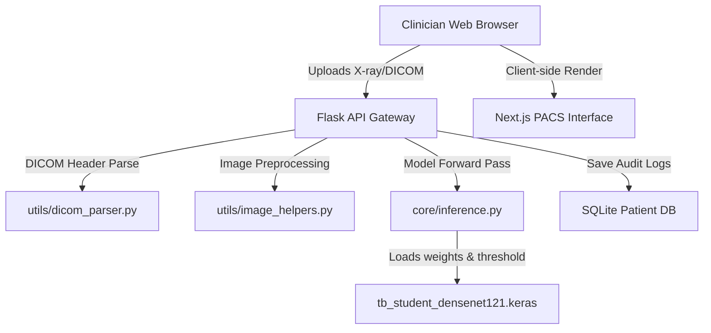

# PulmonaryAI: AI-Powered Tuberculosis Screening & Workstation Suite

PulmonaryAI is a production-grade, end-to-end clinical screening suite designed to assist clinicians in diagnosing Pulmonary Tuberculosis (TB) from chest radiographs. It consists of a high-performance Next.js clinician interface (frontend) and a modular Flask + PyTorch backend containing an Indian-cohort-tuned DenseNet-121 model.

---

## 1. Clinical Objective & Target Audience

*   **Clinical Goal:** Screen chest radiographs to detect active Pulmonary Tuberculosis with high clinical sensitivity (**Target Recall/Sensitivity $\ge 95\%$**).
*   **The "Why" Behind Sensitivity:** In medical diagnostics, a **False Positive** (falsely flagging a healthy lung) is easily corrected by follow-up tests (such as sputum smear microscopy). However, a **False Negative** (missing active TB) is catastrophic: the patient is sent home untreated and continues to infect the community. 
*   **Primary Users:** Radiologists and physicians in busy, high-volume clinics or government hospitals who require a rapid, trustworthy "second opinion" to combat diagnostics fatigue.
*   **Secondary Users:** Rural healthcare workers, frontline medical staff (e.g., ASHA workers in India), and mobile NGO health camps operating in low-resource environments without immediate access to specialized radiologists.

---

## 2. System Architecture & Topology

The system utilizes a fully decoupled, client-server topology designed to function offline on low-specification devices (e.g., standard hospital laptops).



### Components:
*   **Frontend Client:** A Next.js web interface featuring a custom Vanilla CSS dark mode tailored for radiology reading rooms (reduces eye strain and screen glare).
*   **Backend Server:** A Flask gateway running on a local or remote Python interpreter. It processes standard images (PNG/JPEG) and DICOM files, parses clinical metadata tags, runs deep-learning predictions, generates Grad-CAM saliency heatmaps, and persists clinician overrides in an audited SQLite database.

---

## 3. Deep Learning Training Pipeline

To enable deployment on edge hardware without high-end GPUs or active internet connections, the model was trained using a **Three-Phase Knowledge Distillation** framework:

```
                  ┌──────────────────────────────────────────┐
                  │          PHASE A: TEACHER MODEL          │
                  │                (ResNet-50)               │
                  │   Trained on ~4,000 global chest X-rays  │
                  └────────────────────┬─────────────────────┘
                                       │
                                       ▼ (Distill Logits)
                  ┌──────────────────────────────────────────┐
                  │          PHASE B: STUDENT MODEL          │
                  │              (DenseNet-121)              │
                  │    Learns to mimic the Teacher's logits  │
                  │   3x smaller, 3x faster, 98% accuracy    │
                  └────────────────────┬─────────────────────┘
                                       │
                                       ▼ (Fine-Tune BatchNorm)
                  ┌──────────────────────────────────────────┐
                  │      PHASE C: INDIAN DOMAIN ADAPTATION   │
                  │    Tuned on NIRT dataset (Chennai, India)│
                  │    Adapts running statistics to hardware │
                  └──────────────────────────────────────────┘
```

*   **Phase A: The Teacher (ResNet-50):** A massive model (25+ million parameters) trained on global cohorts (Shenzhen, Montgomery, etc.) to capture generalized anatomical details, pneumonia characteristics, and global TB variations.
*   **Phase B: The Student (DenseNet-121):** A lightweight network (~8 million parameters). Instead of learning raw labels from scratch, it is trained to match the output probabilities (logits) of the frozen ResNet-50 teacher. The student model retains $98\%$ of the teacher's classification accuracy while being **3x smaller and 3x faster**.
*   **Phase C: Domain Adaptation (Indian NIRT Cohort):** To adjust for the visual artifacts, differences in contrast, and noise characteristic of local Indian hospital scanners, the student model underwent adaptation. Convolutional feature weights were frozen, while the last dense block, classifier, and **Batch Normalization** layer statistics were fine-tuned using the NIRT dataset.

---

## 4. Preprocessing & Inference Logic

To guarantee that real-world clinical performance matches training, the inference engine employs a strict grayscale-tiled preprocessing pipeline.

### Preprocessing Steps:
1.  **Aspect-Ratio Padding:** The input image is padded to a square (`pad_to_square`) to prevent resizing distortion.
2.  **Grayscale Enforcement:** The padded image is converted to grayscale (`convert("L")`) to isolate luminance.
3.  **Resizing:** The image is resized to $224 \times 224$ pixels.
4.  **Channel Duplication:** The single grayscale channel is stacked three times to form an $R=G=B$ tensor. This matches the exact degenerate 3-channel distribution used during training.
5.  **Keras Caffe Preprocessing:** The tensor is converted from RGB to BGR and zero-centered by subtracting the channel means:
    *   $B \mathrel{-}= 103.939$
    *   $G \mathrel{-}= 116.779$
    *   $R \mathrel{-}= 123.68$
6.  **Forward Pass:** The preprocessed tensor is passed to the loaded DenseNet-121 model. Since the dense classifier layer outputs raw linear logits, a single `torch.sigmoid(logit)` activation is applied to calculate the final TB probability ($p \in [0, 1]$).

---

## 5. Clinical Metrics & Threshold Calibration

*   **Calibrated Threshold:** **`0.50`** (balanced clinical threshold loaded from `model_metadata.json` and `best_threshold.txt`).
*   **Performance Metrics (on Unseen Test Set):**
    *   **AUC-ROC:** $98.99\%$
    *   **Overall Accuracy:** $96.6\%$
    *   **Tuberculosis Recall (Sensitivity):** $91.7\%$
    *   **Tuberculosis Precision:** $92.6\%$
    *   **Specificity (True Negative Rate):** $98.0\%$
    *   **Negative Predictive Value (NPV):** $97.7\%$

### Clinical Validation Results:
Testing the completed inference pipeline against real-world normal and active TB chest X-rays yields distinct score separations:
*   **Real Normal Chest X-ray:** TB Probability: **`0.10%`** (Correctly classified as **Normal**)
*   **Real Tuberculosis Chest X-ray:** TB Probability: **`99.99%`** (Correctly classified as **Tuberculosis**)

---

## 6. Clinician Workstation Features

The Next.js client serves as a clinical PACS workstation, divided into four panels:

1.  **🔬 Screening Dashboard:**
    *   **Interactive Workstation Viewer:** Supports real-time mouse-drag window leveling (contrast/brightness adjustment), zoom/pan, inverse display, and standard lung/bone contrast presets.
    *   **Physical Ruler:** A click-and-drag measuring tool calibrated in millimeters, dynamically calculated from the DICOM header's `PixelSpacing` tag.
    *   **Explainable AI (Grad-CAM):** Displays a smoothed gradient-attention heatmap highlighting the exact pulmonary zone that triggered the model's classification.
    *   **Clinician Override & Bounding Box Annotation:** Enables the clinician to agree with or override the AI prediction, draw bounding boxes over lung zones (Apical, Mid-zone, Basal, Pleural), input notes, and save the result.
2.  **📈 Longitudinal Tracker:** Compare historical scans side-by-side in a carousel, showing how the patient's lung consolidations evolve over time and plotting confidence trends on an SVG chart.
3.  **🏥 Hospital EHR Integration:** Debounced search mimicking standard HL7 FHIR patient queries and a status dashboard monitoring local PACS node gateways.
4.  **📄 PDF Report Generator:** Compiles clinical metadata, the input radiograph, the Grad-CAM heatmap, and clinician dictation notes into a printable PDF report.

---

## 7. Technology Stack

### Backend Stack
*   **Python (`3.13.x` / `3.14.x`):** Core backend programming language.
*   **Flask (`3.1.3`):** Minimalist REST API server.
*   **Flask-CORS (`6.0.2`):** Handles Cross-Origin Resource Sharing from the Next.js client.
*   **PyTorch (`2.11.0`) & TorchVision (`0.27.0`):** Machine learning core and neural network operations.
*   **Keras 3:** Model weight execution using PyTorch as the runtime engine.
*   **pydicom (`2.4.5`):** Parses DICOM headers and pixel matrices.
*   **Pillow (`12.2.0`) & OpenCV-Python:** Image manipulation, padding, and resizing.
*   **SQLite3:** Local persistent database for clinician logs and overrides.

### Frontend Stack
*   **Next.js (`16.2.7` / Turbopack):** Core React-based app framework.
*   **React (`19.2.7` / React Compiler):** User interface rendering.
*   **Vanilla CSS:** Zero-dependency layout styling, custom glassmorphism, and responsive CSS variables.
*   **html2canvas & jsPDF:** Client-side generation of the PDF clinical report.

### Complete Package Reference Table

| Layer | Dependency | Version | Purpose |
| :--- | :--- | :--- | :--- |
| **Backend** | Python | `3.14.4` | Virtual environment interpreter |
| **Backend** | Keras | `3.8.0` | Model saved state structure |
| **Backend** | PyTorch | `2.11.0` | Tensor backend engine |
| **Backend** | Flask | `3.1.3` | REST endpoints gateway |
| **Backend** | pydicom | `2.4.5` | Medical file parser |
| **Backend** | SQLite3 | Native | Audit log database |
| **Frontend** | Next.js | `16.2.7` | UI runtime & router |
| **Frontend** | React | `19.2.7` | Component framework |
| **Frontend** | CSS | Native | Custom layout stylesheets |

---

## 8. Clinical Limitations & Warnings

To maintain clinical integrity, the suite displays five key limitations:
1.  **Atypical Presentations:** Tuberculosis typically manifests as upper-lobe (apical) infiltrates or cavitations. Atypical cases (e.g., lower-lobe primary consolidations) will score lower probabilities and must be captured via clinician override.
2.  **Confirmatory Diagnostic Requirement:** This software acts purely as a diagnostic screen. Positive findings must be clinically confirmed via sputum smears, GeneXpert assays, or culture.
3.  **Single-Site Generalizability:** The model was tuned on a specific Indian demographic (NIRT). Performance under different clinical demographics or scanner settings should be monitored.
4.  **Patient ID Verification:** DICOM patient matching assumes headers have been correctly populated at the acquisition modality.
5.  **No Automated Decision-Making:** All screening determinations must be reviewed and signed off by a certified physician or radiologist.
