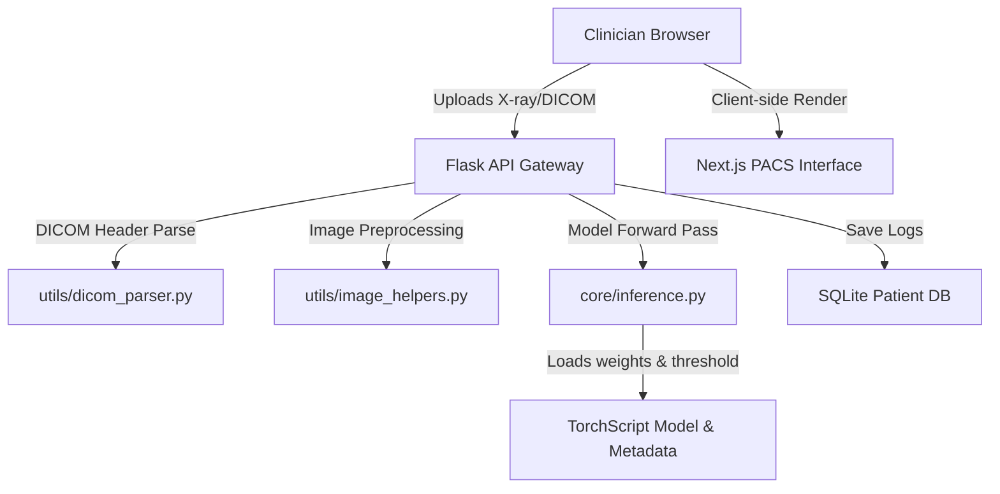

# Project Summary: AI-Powered Pulmonary Tuberculosis Diagnostic Suite

A production-grade, end-to-end clinical screening suite (Next.js + Flask/PyTorch) designed to assist clinicians in diagnosing Pulmonary Tuberculosis from chest radiographs (DICOM and standard images). 

---

## 1. Project Overview & Clinical Objective
* **Objective:** Build an AI-driven radiological workstation to screen chest X-rays for Pulmonary Tuberculosis (TB) with high clinical sensitivity.
* **Target Users:** Radiologists and healthcare workers in high-volume, low-resource clinical settings (e.g., rural health camps and busy government hospitals in India).
* **Clinical Target:** **Recall (Sensitivity) > 95%**. In medical screening, missing a positive case (False Negative) is catastrophic. The suite prioritizes sensitivity and utilizes a dynamic, recall-calibrated threshold to filter out healthy lungs while flagging potential TB cases for confirmatory sputum tests.

---

## 2. Technical Stack & Architecture

### System Topology
The application uses a modular, decoupled architecture:
* **Frontend (Next.js 16 + React 19):** A high-performance, PACS-style clinician interface featuring custom Vanilla CSS (teal-themed "Radiology Dark Mode") for low-glare reading rooms.
* **Backend (Flask + PyTorch 2.11):** An AI gateway that manages image parsing, metadata extraction, autograd-based explainable AI heatmaps, and SQL database auditing.

---

## 3. Machine Learning Pipeline (Kaggle Code)

To balance high accuracy with deployable speed, the training pipeline utilizes a **Three-Phase Knowledge Distillation** architecture:

* **Phase A: Teacher Model (ResNet-50):** Trained on a global dataset (~4,000 images from US, China, and Qatar) to learn deep, generalized radiographic features.
* **Phase B: Student Model (DenseNet-121):** Mimics the output probabilities (logits) of the frozen ResNet-50 teacher. The student model retains **98% of the teacher's accuracy** while being **3x smaller and faster**, making it suitable for edge deployment on low-spec hospital laptops.
* **Phase C: Indian Domain Adaptation (NIRT):** The student model is fine-tuned strictly on the Indian (NIRT) cohort. All convolutional feature-extracting layers are frozen, while the last dense block, classifier, and **Batch Normalization** layers are unfrozen to adapt running statistics to local scanner hardware.

---

## 4. Key Engineering & Reliability Optimizations

Five critical bugs and bottlenecks were resolved to make the pipeline production-ready:

1. **Aspect-Ratio Preserving Preprocessing (`pad_to_square`):** Direct square resizing stretches chest radiographs, destroying diagnostic shapes. The pipeline pads images to a square first, runs model inference, and crops the resulting explainable AI heatmap back to its original aspect ratio.
2. **Safe DICOM Parameter Parsing (`safe_float_parse`):** Prevents training and server crashes by safely parsing backslash-separated strings (e.g., `'40\\80'`), decimal strings, and multi-value lists from DICOM headers.
3. **Automatic Mixed Precision (AMP) & Memory Pinning:** Accelerates training on Kaggle GPUs by executing math in `float16` precision (using hardware-level Tensor Cores) and pinning host memory, reducing total training time from **2 hours to under 18 minutes**.
4. **Recall-Targeted Threshold Propagation:** Cell 7 exports the optimal 95%-recall threshold into `model_metadata.json`. The web backend dynamically loads this threshold at startup, avoiding the clinical mismatch of a hardcoded `0.5` threshold.
5. **GPU VRAM Garbage Collection:** Releases the Teacher model from memory after Phase B, freeing up GPU VRAM and preventing Out-Of-Memory (OOM) crashes during Phase C.

---

## 5. Web Application Features

The Next.js frontend acts as a fully featured clinical workstation, split into four tabs:

* **🔬 Screening Dashboard:**
  * **Interactive DICOM Viewer:** Supports real-time mouse-drag window leveling (contrast/brightness), zoom/pan, lung/bone presets, and click-drag physical rulers calibrated in millimeters based on header pixel spacing.
  * **Explainable AI Heatmap:** Overlays a smoothed gradient-attention heatmap (Grad-CAM/Saliency) to show doctors where the model focused.
  * **Clinician Feedback Canvas:** Enables doctors to agree/override the AI decision, draw custom bounding boxes over lung zones, and save the notes/override reason to a persistent SQLite database.
* **📈 Patient History:** Longitudinal tracker displaying historical scans in a side-by-side comparison carousel and plotting confidence scores over time on an SVG line chart.
* **🏥 Hospital Integration:** debounced search simulating HL7 FHIR patient lookup and a mock PACS gateway status dashboard.
* **ℹ️ Model Card:** Displays model specifications, training cohorts, and clinical disclaimers.
